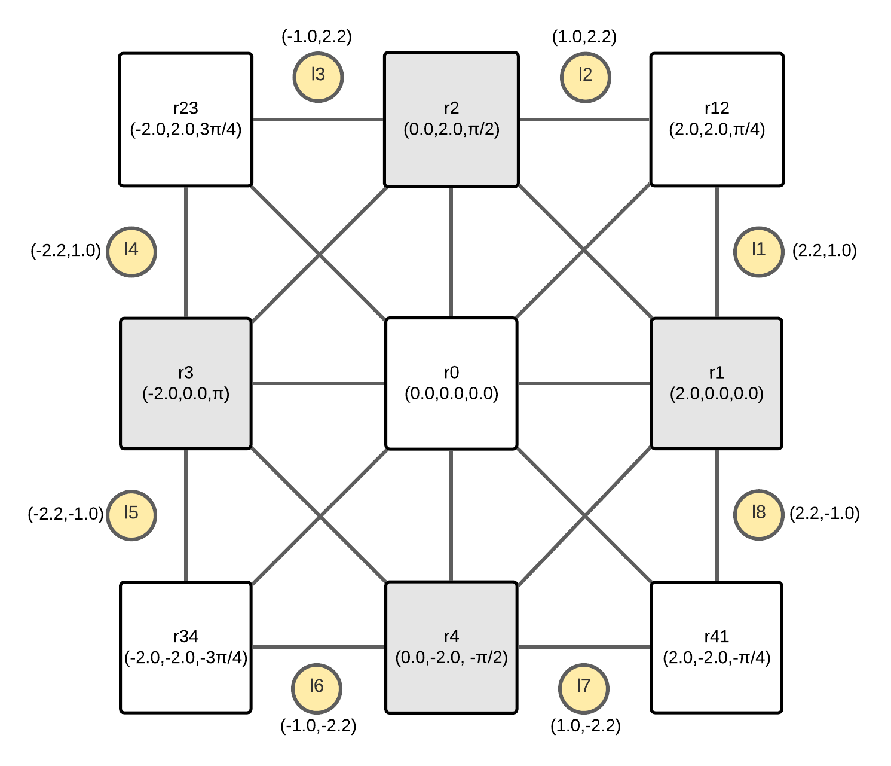
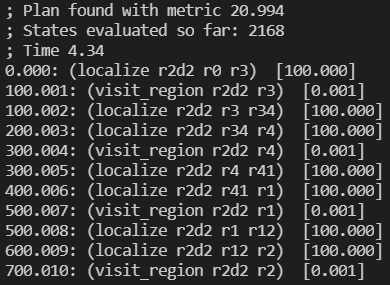
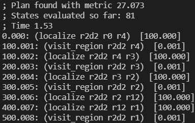
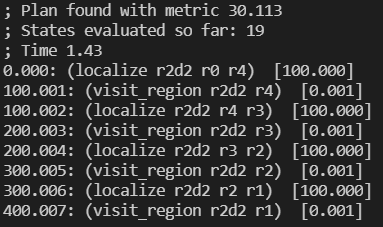

# AI4RO2 - Second Assignment

> Marco Gabriele Fedozzi, 5083365@studenti.unige.it

## Task Motion Planning

The content of this repository is an implementation of the system required by the Second Assignment of the **Artificial Intelligence for Robotics II** at [University of Genoa, MSc in Robotics Engineering](https://courses.unige.it/10635). The system here presented is a variation of the base implementation produced by [Anthony Thomas et al.][1], which goal is to implement a [PDDL 2.1][2] domain dealing with the movement of a mobile robot in a constrained environment. The robot is able to move between predefined waypoints, grouped into regions, and, in this scenario, must visit a subset of them in pseudo-optimal way.
Each path between two regions is associated with a cost, a function of the Euclidean distance between their two closest waypoints and the trace of the Covariance matrix associated to the robot State ($x, y, \theta$); the robot state is, in fact, assumed affected by uncertainties due to odometry errors, which add up during the whole path between two waypoints. Beacons are present in the environment and provide an extrinsic reference, being measurable by the robot when passing close enough to one of them, obtaining both the squared distance and the relative heading with respect to the robot frame (assumed coinciding with the sensor providing such data). This data is used in an **Extended Kalman Filter** model, in order to update the robot state and the Covariance matrix associated to it.
The path planning is carried out by the PDDL 2.1 planner, whilst an external solver (a *semantic attachment*) computes the weight associated to each edge connecting regions.
More info on each step in the respective section later on.

## Content

```
ai4ro2_2/
    |
    visit_domain/   , task planning files
        |
        dom1.pddl       , domain description
        landmark.txt    , beacons poses
        prob1.pddl      , problem description
        region_poses    , association region-waypoints
        waypoint.txt    , waypoint poses
    |
    visit_module/   , motion planning files
        |
        src/            , motion planning scripts
            |
            CMakeLists.txt  , the cmake used, linking directories to the library
            ExternalSolver.cpp  , definition of the interface used for the semantic
                                  attachments
            ExternalSolver.h    , declaration of the interface used for the semantic
                                  attachments
            VisitSolver.cpp     , definition of the class implementing the interface,
                                  computing the EKF
            VisitSolver.h       , declaration of the class implementing the interface,
                                  computing the EKF
            buildInstruction.txt, script used to build the library
            main.cpp            , main using the solver, can be used for a standalone
                                  test executable (unused here)
    |
    LICENSE     , GNU v3.0 license
    README.md   , this file
```

---

## Task Planning

The planner for which the system is defined is [popf-tif][3], chosen thanks to its ability to deal with numerical fluents, temporal planning and *semantic attachments*.
The original domain and problem files have been only lightly modified, with the introduction of a new action, `localize`, moving the robot between two regions and responsible for calling the *semantic attachment*.
Such call is carried out thanks to a syntactic trick: every time the PDDL 2.1 keyword *increase* is encountered a call to the external solver is made, passing  to it the map of all the parameters interested by such increase, and receiving a map of all the values modified in return.
At the same time, the previously defined action `goto_region` has been changed into `visit_region`, since it now only sets a region as *visited* if the robot finds itself in it, without dealing directly with the localization and planning aspect. While its usefulness might be debatable in this toy example (since the `localize` action could set the region as visited by itself), it allows to expand the notion of "visiting a region" in future installments: as an example, think of a waiter robot case, where the robot might move between tables with different goals in mind, either serving dishes, taking orders, or cleaning the tables. No changes to the `localize` action here presented would be necessary in order to achieve that.

Furthermore, the connectivity of the waypoint graph has been reduced, from "complete" to "implementation specific", thanks to the addition of the `(connected region1 region2)` predicate. This choice has been made both to reduce, albeit slightly, the search space dimension at each step, and to better demonstrate the effect of the external planner in the definition of the cost.

## Motion Planning

The computation-side of the planning is being taken care of by an External Solver, expressed here by the library `libVisits.so`. The majority of its implementation is done in the `VisitSolver` class.
The robot here modeled is a simple holonomic one, so as not to have kinematic constraints in the path planning, allowing for simple straight paths between start and goal poses; the choice has been made to speed up developing and testing. Ideally the system should work also for more complex robot models, with a few modifications in the matrices used by the EKF.

Each time a request for a localization is detected, the system finds the two closest waypoints in the regions to move `(from, to)`, and then performs a fictious movement and localization with an EKF along the straight path connecting them.

> NOTE: here only one waypoint is expressed for each region, but the system can seamlessly be extended to a more general scenario.

To simulate the robot movement, the path is then split up into segment which length amounts to the distance traveled (ideally) by the robot between two consecutive odometry measurements (see later subsection regarding **EKF tuning** for more info on this aspect).
For each of these steps the robot state `X_k` is updated, as is its covariance matrix `P_k`, with only the odometry data and a synthetic Gaussian noise simulating odometry inaccuracy.  
Furthermore, if the robot is close enough to one of the beacons, `X_k` and `P_k` are updated with EKF approach, using the measurement **innovation** and the "confidence" in such value.

$$   
\begin{cases}   
    \hat X_{k+1/k} = \Delta D_{k} + \alpha_{k} \\     
    P_{k+1/k} = A_k P_{k/k} * A_k^T + Q_{\alpha}   
\end{cases}   
$$   
> *Odometry-only update*

$$  
\begin{cases}   
    \hat X_{k+1/k+1} = \hat X_{k+1/k} + K_k (Y_k - g (\hat X_{k+1/k} ) ) \\   
    P_{k+1/k+1} = (I - K_kC_k)P_{k+1/k}
\end{cases}   
$$  
> *Beacon-detection update*

*See [Extended Kalman Filter](https://en.wikipedia.org/wiki/Extended_Kalman_filter) on Wikipedia for more details on what each term represents and for a more detailed description of each step.* 

### EKF tuning

EKF parameters, mostly noise related ones, need to be  tuned to appropriately model the system. In this specific case, since no details were given on the possible sensors or type of robot used, the values have been found through guesstimates and empirical tests, until the desired and expected behavior of the system emerged.
Plese refer to the `VisitSolver.h` header for any further info on those values, here reported for accessibility:

- **robot_vel = 0.1**   
 The robot linear velocity, used to detect the minimum displacement $\Delta D$ between two successive odometry measures. Chosen *10 cm/s* as a reasonable value for a lab robot.
- **odom_rate = 20**  
 The sample rate of the fake odometry sensor, expressed in Hz. Again, a reasonable guesstimate to demonstrate its impact on the state evolution.
- **odom_noise_mod = 0.005**   
 The $\sigma_{odom}$ of the odometry noise added each step to the robot state. Due to the synthetic nature of the introduced noise, a balance between $\Delta D$ and Gaussian noise amplitude had to be defined (otherwise the system would update too fast with an unreasonably large error, or vice versa). The value chosen, *5mm*, is roughly the robot translational movement between two successive odometry steps. Setting the odometry error to the same order of magnitude makes its impact easy to see, and such inaccuracies are not unheard of (although, of course, a more realistic system would see different errors depending on the robot configuration and controller).
 - **detection_noise_mod = 0.05**  
  The $\sigma_{meas}$: uncertainty on the "measured" beacon position, here *5 cm*.
- **beacon_dist_th = 0.5**  
 The distance at which the robot can detect a beacon, here *50 cm*. It's pretty small, given the *5 cm* detection error on the beacon measurement, but serves its purposes in the designed system, "enforcing" some routes (the external ones) instead of others. Definetely not a superlative beacon choice, might be akin to AprilTags?
- **init_noise = 0.14**   
 The starting noise for each localization attempt, so as to have $P_{init} = 0.02 * I_{3x3}$
- **trace_weight = 50**  
 The weight given to the $trace(P_k)$ in the cost of each region graph edge (the one returned to the *Task Planning* side and ideally to minimize). This value has been empirically found to yield a good balance between the Euclidean distance `(start, goal)` and the "confidence" in the path.  
 The cost function becomes
 $$
    cost = dist(start,goal) + 50 * trace(P_{(start,goal)})
 $$
where the notation used for $P$ indicates the covariance matrix obtained by running the EKF from the starting to the goal configuration.

## Building and Running

As mentioned, the planning used is [popf-tif](https://github.com/popftif/popf-tif), which needs to be installed together with this package.
This package uses [Armadillo](http://arma.sourceforge.net/docs.html) tools to optimize the matrix computations, please install it as well and pay attention to all the dependencies it needs.
Lastly, the *semantic attachment* library can be built with

```bash
    ai4ro2_2/visits_module/src$ ./buildInstructions.txt
```

Once the building process completes, the planner can be executed with

```bash
    ai4ro2_2/visits_domain$ path/to/popf3-clp -x -n -t10 dom1.pddl prob1.pddl \
                            ../visits_module/build/libVisits.so region_poses
```
The `-x` flag is used to inform the planner that we are going to pass it a library with the external solver description; the `-n -t10` flags are used instead to enable the *anytime* planning modality, making the system run for uo to *t* seconds (here *10*), which allows to expand the first solution found, hoping to discover better routes.
> WARN: This last flags are *mandatory* to actually obtain a semi-optimal planning, since with the first run the planner generally doesn't seem to take into account the cost of traversing each edge, focusing instead on plan length, might be a problem of local minima.

---

## Testing

The `region_poses`, `waypoint.txt`, and `landmark.txt` files describe a planning scenario developed to highlight the impact of the covariance matrix on the choice of a path. These files can be modified in order to depict diffent scenarios, even complex ones, thanks to their minimalistic syntax.

### The Map

<p align="middle">
    
</p>
This is the map described by the files currently present in this repository, where the box represent waypoints, circles are beacons, and the lines the edges of the region graph.
The robot starts in the center region `(0,0)` and has to reach the 4 cardinal regions (1:E, 2:N, 3:W, 4:S, here in light gray), whereas the vertices of the square are just intermediate regions (12:NE, 23:NW, 34:SW, 41:SE).
Passing for the outer edges brings the robot close enough to the beacons to detect them and reduce the uncertainty on its state, and are thus the preferred choices for the Task Planner in this implementation.

### Expected Results

By using the default values and scenario here presented, the results obtained from the planner should be similar to these:
<p align="middle">
    
    
    
</p>

> *left to right:* `optimal`, `sub-optimal`, and `non-optimal` plans

where, by looking at the map previously presented, we can notice that in the optimal scenario the robot travels along the outer edges, closer to the beacons ans thus lowering the localization uncertainty. Notice also that the difference in cost between an optimal plan and a simplistic one (where the robot moves directly between the 4 goal regions) is not extraordinary large, meaning the system could (and generally does) opt for hybrid solutions (see the middle plan).

By tuning the **trace_weight** parameter, we can enforce different approaches, from a planning purely based on Euclidean distance (low **trace_weight**), obtaining something close to the last one presented above, or one where the covariance matrix becomes the predominant factor (high **trace_weight**, which results might be more evident in an ad-hoc map).

## Source code

The complete code can be found on the [GitHub Repository](https://github.com/hypothe/ai4ro2_2/).

## Docker Image

To make it easier to install and test the system, especially considering the relatively long list of dependencies, a Docker Image is provided: [hypothe/ai4ro2_2:priv](https://hub.docker.com/repository/docker/hypothe/ai4ro2_2).
Every important note is already written at that link. I highly suggest to give it a try, since it makes testing the system that much faster and more manageable!
> NOTE: be sure to pull the "priv" tag, since the "latest" one does not automatically pull the repository with the code here presented.

## References

[1]: Thomas, Antony, Fulvio Mastrogiovanni, and Marco Baglietto. "Task-motion planning for navigation in belief space." arXiv preprint arXiv:1910.11683 (2019).

[2]: Fox, Maria, and Derek Long. "PDDL2. 1: An extension to PDDL for expressing temporal planning domains." Journal of artificial intelligence research 20 (2003): 61-124.

[3]: Bernardini, Sara, et al. "Boosting search guidance in problems with semantic attachments." Proceedings of the International Conference on Automated Planning and Scheduling. Vol. 27. No. 1. 2017.